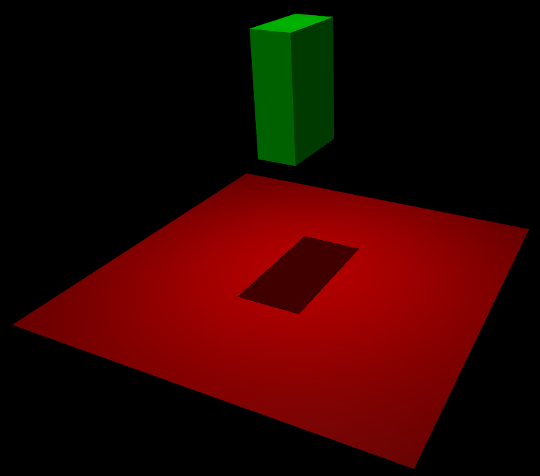

# MuJoCo Basics

## MJCF file format 

The standard file format for describing a robot is the universal robotic description format (URDF). MuJoCo tweaked the file format and created its own format called MJCF. This format is easy to understand and manipulate so that you can create objects from scratch or import other objects. 

However there is one limitation in terms of what files you can import as MuJoCo automatically creates convex hulls for collision detection. This implies that in case you use a concave object such as a cup, other objects will not be able to go through. 

In order to see the simplicity of the format, let's see the following hello world of MuJoCo that is available in `hello.xml`:

```
<mujoco>
   <worldbody>
      <light diffuse=".5 .5 .5" pos="0 0 3" dir="0 0 -1"/>
      <geom type="plane" size="1 1 0.1" rgba=".9 0 0 1"/>
      <body pos="0 0 1">
         <joint type="free"/>
         <geom type="box" size=".1 .2 .3" rgba="0 .9 0 1"/>
      </body>
   </worldbody>
</mujoco>
```

First of all, in order for MuJoCo to interpret the file, everything has to be within `<mujoco>`. Secondly, all the bodies (objects) are added under the world body. 

Without any prior information, we can see that the first element is a `light` object, the second is a `geom` and defines our floor. Then we have a body that is composed of a box `geom` and it is not attached to any other body. Under a body we can combine multiple geom and joints to create a more complex model. This fairly simple model does nothing but allows a box to fall on the floor. 

This is how the model should look like:




## Importing a MJCF into Python
We will have to import the model to our python file in order to work with it. First we have to import the required modules which are a MJCF loader, the simulation environment and a viewer to help us visualise it:

```
from mujoco_py import load_model_from_path, MjSim, MjViewer
```

Next we have to load our model, pass it to our simulator and setup the viewer:

```
model = load_model_from_path("assets/hello.xml")
sim = MjSim(model)
viewer = MjViewer(sim)
```

With those components, we can run a simulation loop. We start the simulation and with each iteration we advance the simulation by one timestep:

```
for _ in range(2000):
    viewer.render()
    sim.step()
```

This completes the program and we can now run it and we shall see a box that falls on the floor.

```
from mujoco_py import load_model_from_path, MjSim, MjViewer

model = load_model_from_path("assets/hello.xml")
sim = MjSim(model)

viewer = MjViewer(sim)

for _ in range(2000):
    viewer.render()
    sim.step()
```

There is much more we can do and we will see in the next part but in essence those are the steps required to run it:
1. Create a MJCF file format describing your model
2. Import it into Python
3. Run a loop and do stuff at each step

## Multiple bodies


In order to create a complex body we need other bodies (meshes or geoms) that are linked together by joints. 

There are several types of bodies in MuJoCo where a camera is also considered a body, however no other bodies can be attached to it:

* plane
* hfield
* sphere
* capsule 
* ellipsoid 
* cylinder 
* box
* mesh
* camera

And several joints:

* **free:** makes the body floating or otherwise locks it in place
* **ball:** has three rotational degrees of freedom and allows rotation (e.g. the shoulder)
* **slide:** has one translational degree of freedom (e.g. a train that moves on a straight line) 
* **hinge:** has one rotational degree of freedom. (e.g. a robotic elbow)
 

Combining those will result in more complex bodies and make realistic bodies. The best way to create something more realistic is to import a mesh. The only difference is that unlike the `geom`, we have to first specify the location of the `mesh`:

```
<mujoco>
	<!-- declare assets (meshes, textures, etc.) -->
	<asset>
		<!-- import mesh given path to location -->
		<mesh file="base_link_collision.stl" />
	</asset>
	<worldbody>
		<!-- use the mesh -->
		<body type="mesh" name="base_link_collision"/>
		<!-- add a camera -->		
		<camera pos="0 0 1" euler="0 0 0"/>
	</worldbody>
</mujoco>
```

## Actuators

In order to move the joints, we need to actuate them. This is done by adding an `actuator` at the end of the file and specifying the joint on which it actuates:

```
<mujoco>
  	<actuator>
		<motor name='actuator_name'  joint='joint_name'/>
  	</actuator>
</mujoco>
```


## Play with the Examples
There are several MJCF examples available within the repository along with some Python example. In order to get them, simply run the following command within the folder where you want to put them or download them manually from [here](https://github.com/tudorjnu/comp341):

```
git clone git@github.com:tudorjnu/comp341.git
```

Try to play with different models for example by using the template provided (`hello.py`) and load different models and run them. Furthermore, you can try to create your own model by combining bodies together with joints. 


More information on what can be used with MJCF can be found [here](https://mujoco.readthedocs.io/en/latest/XMLreference.html).